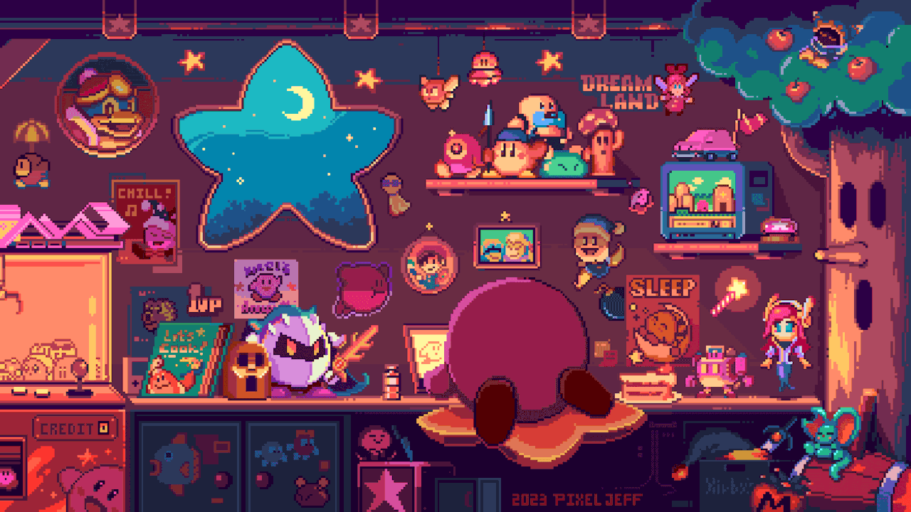

<!--

  
   
-->

<!-- Greeting -->
<h2 align="center">❂ Hi! I am Kayky Quesada Kruger</h2>

<h4 align="left">
🌟 Software Engineering undergraduate at PUCPR (2nd semester - expected graduation: Dec/2028).  
🎯 Seeking an internship in Software Engineering, improving my skills in programming, databases, and frameworks.  
💡 Communicative, empathetic, and creative profile, with experience in the Army, developing discipline, resilience, and focus under pressure.  
🎨 Passionate about technology, innovation, and paper-cutting art, which enhance my attention to detail and creativity.  
</h4>

<!-- Profile Views -->

<!-- Followers -->

---

<h3 align="left">💫 About Me</h3>
<h4>
 🌱 Currently developing my skills in Python, Java/Kotlin, HTML & CSS.  
 🔭 Experienced with SQL, Git/GitHub, database modeling, and IT support.  
 ⚡ Interested in Backend, Web Development, AI/ML, and Automation.  
 ✨ Always looking for innovation, practical solutions, and fast learning.  
</h4>

---

<h3>🧲 Connect with me :</h3>
 
  
 

 

---

<h3 align="center">🌱 Github Stats</h3>

   
   

---

<h3 align="center">📚 Languages & Tools</h3>

   
  

---

<h3 align="center">⭐️ Experiences</h3>

- 🎖 **Brazilian Army** (2024–2025) — IT Assistant: hardware/software maintenance, networks, and technical support.  
- 🍽 **Sakada Restaurant** (2024–2025) — Cashier: customer service and stock management.  
- 👨‍🏫 **PUCPR** (2025) — Algorithm Reasoning Teaching Assistant: helped colleagues improve their logical thinking.  
- 💡 **Academic Projects**: Group SPINERS (pet care app) and Iagre.io Challenge (website design for electronic invoices).  

---

<h1 align="center">
    
</h1>

